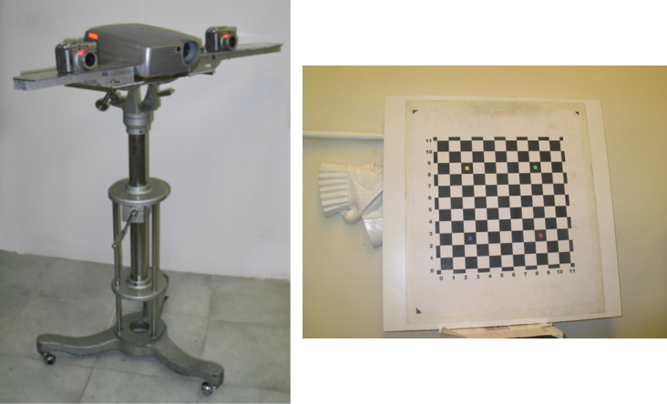

# Structured-Light-Scanner
A simple 3D light scanner based on the Coded Structured Light and Close-range Photogrammetry principles

Structured Light Scanner including two digital cameras and one projector

Resulting Point Cloud

# Reference
How to cite: Pashaei, M. and Mousavi, S. M.: IMPLEMENTATION OF A LOW COST STRUCTURED LIGHT SCANNER, Int. Arch. Photogramm. Remote Sens. Spatial Inf. Sci., XL-5/W2, 477–482, https://doi.org/10.5194/isprsarchives-XL-5-W2-477-2013, 2013.
